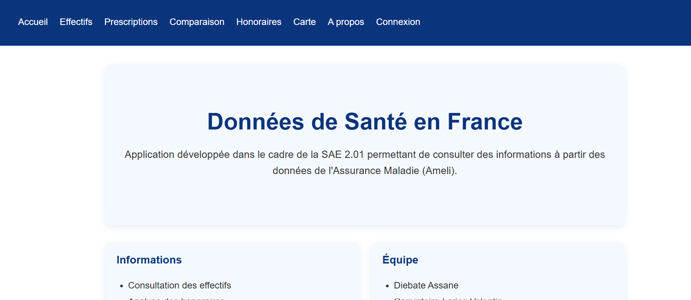
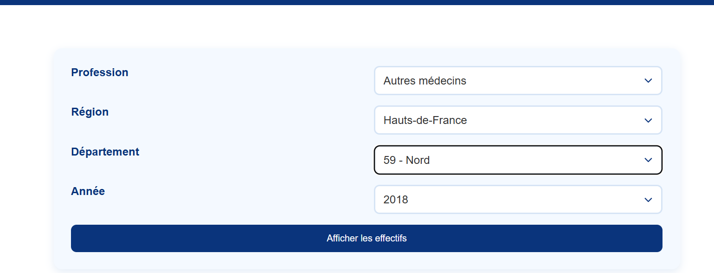
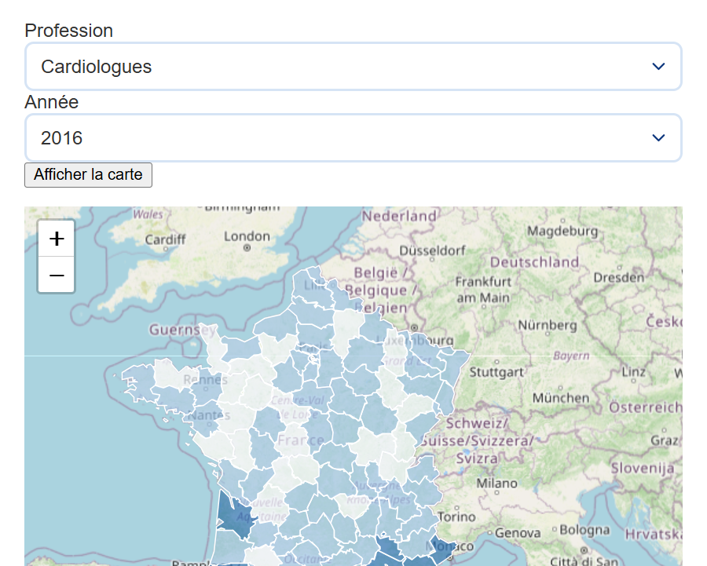
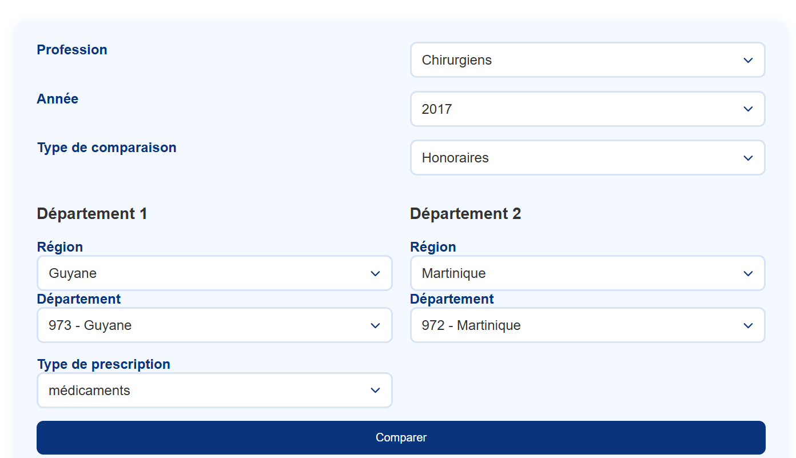
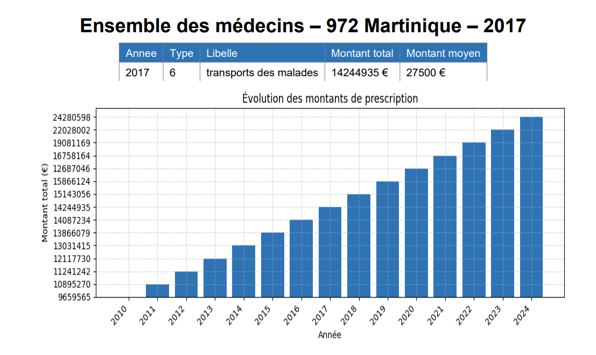

# SAE 2.01 — Données de santé libérale

Application web Flask permettant de consulter, visualiser et comparer les données de santé issues de l'API data.ameli.fr (effectifs, honoraires, prescriptions) par profession et par territoire.

## Équipe

- Sami AZZOUG | Page Honoraires (sélection du type d'honoraire)

- Valentin CARPINTEIRO-LERICQ | Page d'accueil avec formulaire de sélection (profession, région, département, année) ; Page "A propos" ; Page "Effectifs"

- Assane DIEBATE | Export des données au format CSV et PDF ; Carte interactive des densités par département (Leaflet) ; README

- Nohlan MOMPEROUSSE | Page "Prescriptions"

- Arthur SIVAULT--LE MORELLEC | Mise en cache des appels API ; Authentification administrateur ; Graphique d'évolution (Chart.js) 

## Fonctionnalités implémentées

### Fonctionnalités minimales
- [x] Page d'accueil avec formulaire de sélection (profession, région, département, année)
- [x] Cascade région → département en AJAX
- [x] Page de résultats avec tableau des effectifs et densités
- [x] Graphique d'évolution (Chart.js)
- [x] Gestion d'erreurs (404, paramètres manquants)

### Fonctionnalités avancées
- [x] Page Prescriptions
- [x] Page Honoraires
- [x] Page de comparaison entre deux départements
- [x] Carte interactive des densités par département (Leaflet)
- [x] Export des données au format CSV et PDF
- [x] Mise en cache des appels API

## Stack technique

- Python 3.13
- Flask
- SQLAlchemy + PyMySQL
- Jinja2
- Chart.js
- Leaflet.js
- ReportLab (génération PDF)
- Matplotlib (graphiques dans les PDF)

## Architecture

Le projet respecte l'architecture MVC :

```
SAE201-app/
├── app.py
├── config.py
├── models/          # Modèle : ORM + accès base
├── services/         # Services métier : AmeliAPI, cache
├── controllers/      # Contrôleurs : routes Flask
├── templates/        # Vues : HTML Jinja2
└── static/           # CSS, JS, GeoJSON
```

## Installation

### Prérequis
- Python 3.10 ou supérieur
- Accès à la base MySQL SAE2.04 (connexion via .env)

### Étapes

1. Cloner le dépôt :
```bash
git clone https://github.com/valentincarp/SAE-2.01-D-veloppement-d-une-application.git
cd SAE201-app
```

2. Créer un environnement virtuel :
```bash
python -m venv venv
venv\Scripts\activate
```

3. Installer les dépendances :
```bash
pip install -r requirements.txt
```

4. Créer un fichier `.env` à la racine :
```
DB_USER=sae204_XX_user
DB_PASSWORD=********
DB_HOST=mysql-sae204.alwaysdata.net
DB_NAME=sae204_XX_bd
SECRET_KEY=quelque-chose
APP_BASE_URL=
```

## Lancement

```bash
python app.py
```

L'application est accessible sur [http://127.0.0.1:5000](http://127.0.0.1:5000).

## Captures d'écran

### Page d'accueil


### Consultation des effectifs


### Carte interactive des densités


### Comparaison entre deux départements


### Export PDF



